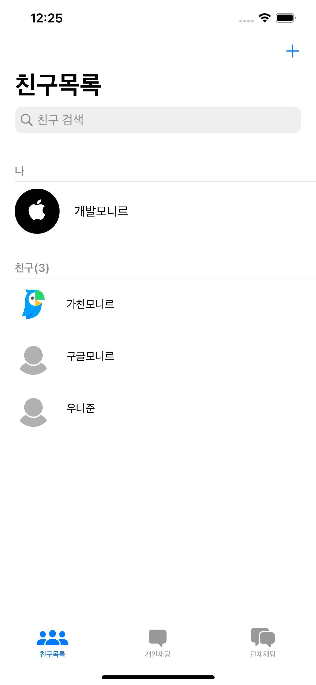
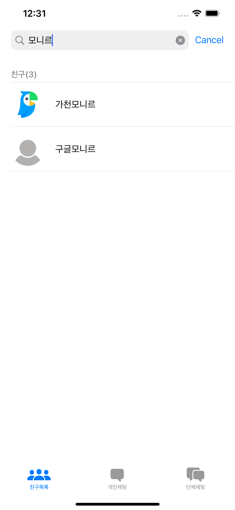
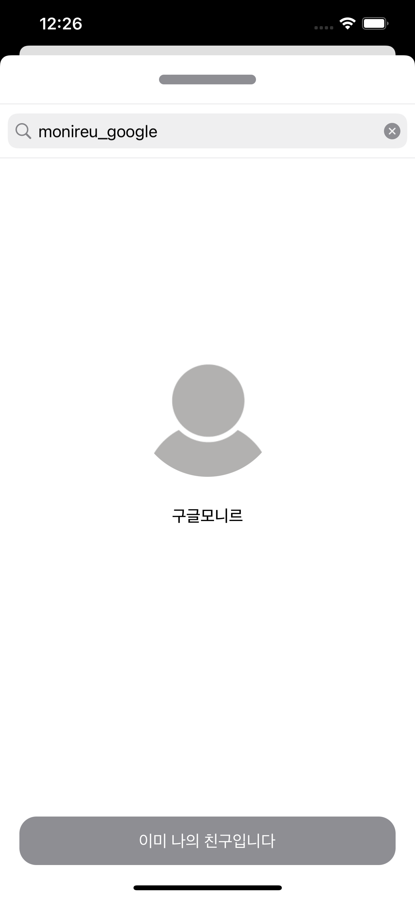
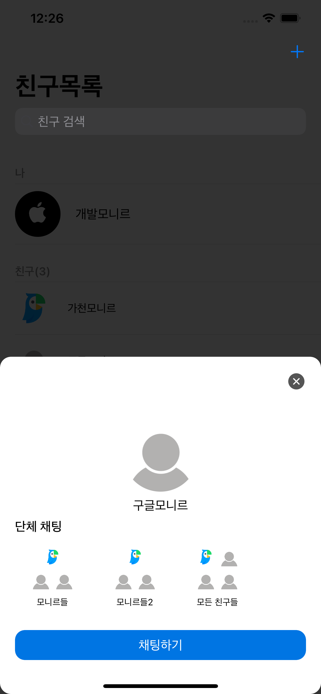
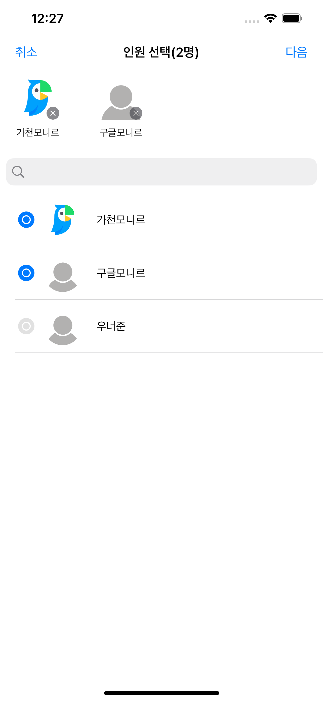
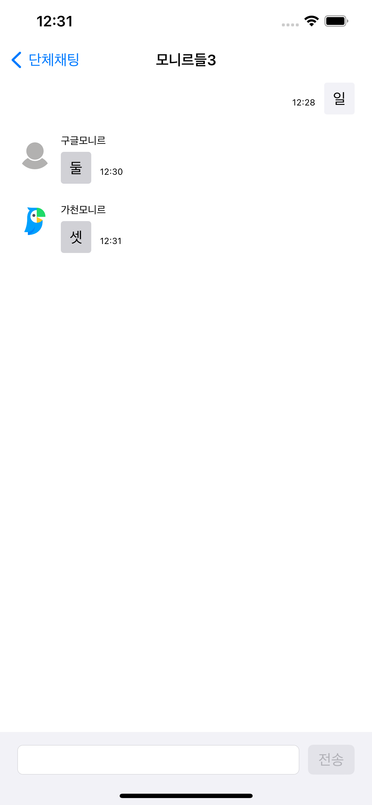

# RxChat
Chat app made by RxSwift
RxSwift와 MVVM패턴을 익히기 위해 진행한 개인 프로젝트.

## 활용기술
- Swift
- RxSwift
- MVVM 패턴
- UIKit
- Realm
- Firebase를 통한 BackEnd 구현
- Google SignIn을 통한 로그인 및 사용자 관리

## 주요기능
- [친구 목록](#친구-목록)
- [목록 검색](#목록-검색)
- [친구 탐색 및 추가](#친구-탐색-및-추가)
- [친구선택 시 속해있는 단체채팅방 출력](#친구선택-시-속해있는-단체채팅방-출력)
- [단체채팅방 생성](#단체채팅방-생성)
- [개인 및 단체 채팅](#개인-및-단체-채팅)
 
### 친구 목록
  

### 목록 검색

### 친구 탐색 및 추가

### 친구선택 시 속해있는 단체채팅방 출력.

### 단체채팅방 생성

### 개인 및 단체 채팅

